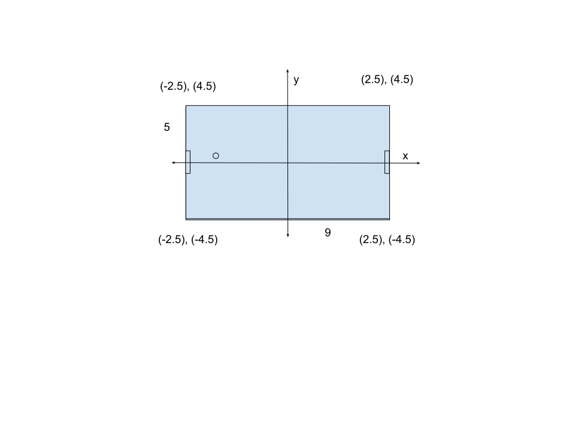

# Docs pong-api
## Intro
Pong-api is microservice that:
* handles incoming connection on websocket, 
* let authorized player to play 3 different game modes: singles, doubles and tournament.
* stores result of games against other players in database, in addition to that tournament is stored on testing Avalanche blockchain too
* have spectator mode


## User Manual
### Connect as spectator
`wss://localhost:8080/pong-api/pong/spectate/{{ROOM_ID}}`

VALID JWT is not required for spectating. Spectator receives all same frames as player but anything spectator send to websocket is completely ignored by server

### How to connect as player
If Pong-api is behind nginx, websocket protocol is secure  `wss` otherwise it is not secure `ws`. In our case nginx is configured that way that anything that is for pong-api is forwarded to container for it. So most basic form of connecting to pong api is: `WEBSOCKET_PROTOCOL://IP:PORT/pong-api/pong/MATCH_TYPE?QUERY` where: 
* WEBSOCKET_PROTOCOL -> `wss | ws`
* IP -> ip address of nginx or pong api (example: `localhost`, `10.12.6.1`, etc )
* PORT -> port of pong-api or frontend (example: `8080`, `3010`)
* MATCH_TYPE -> `singles | doubles | tournament`

Note: You need to have valid JWT from our auth-api in order to play
#### Queries
Queries are optional and send after `?` with `KEY`=`VALUE`
##### roomId
In match type of `singles` and `doubles` client can send query with key `roomId` valid values for this keys are (defined in `pong-api/src/utils/zodSchema.ts`): 
* `public` -> player joins random public room either as HOST(first player) or GUEST (all players that are not HOST)
* `private` -> player become HOST of room where only player who knows roomId can join
* `UUID_OF_ROOM_YOU_WANT_TO_JOIN` -> player joins as GUEST to room of HOST. Example is (`0f2217d6-a378-484e-98a2-4c07a377f5c5`)

If noting is specified it is same as sending `?roomId=public`

#### tournamentSize
In match type tournament client can send query with key `tournamentSize`. valid values for this keys are (defined in `pong-api/src/utils/config.ts`) are `4 | 8 | 16`. 

If noting is specified it is same as sending `?tournamentSize=4`

### Valid examples
* `wss://localhost:8080/pong-api/pong/singles` -> most basic
* `wss://localhost:8080/pong-api/pong/singles?roomId=private` -> SINGLE PRIVATE HOST
* `wss://localhost:8080/pong-api/pong/singles?roomId=0f2217d6-a378-484e-98a2-4c07a377f5c5` -> SINGLE PRIVATE GUEST
* `wss://localhost:8080/pong-api/pong/tournament` -> TOURNAMENT with size 4
* `wss://localhost:8080/pong-api/pong/tournament?tournamentSize=8` -> TOURNAMENT with size 8
* `wss://localhost:8080/pong-api/pong/doubles` -> DOUBLES basic
* `wss://localhost:8080/pong-api/pong/spectate/0f2217d6-a378-484e-98a2-4c07a377f5c5` -> spectate room


### Other routes 
Get Room id of player -> GET `http://localhost:3010/pong-api/player-room/:playerId` -> on 200 returns 
```json
{
  "roomId": "e8522a5e-8f87-44c3-8da2-c9c2dcab3bfe"
}
```
Record from blockchain 
Get Log of tournament game from blockchain -> GET `http://localhost:3010/pong-api/blockchain/:gameId` -> on 200 returns 
```json
{
    "message": "Record found",
    "record": "[\"e8522a5e-8f87-44c3-8da2-c9c2dcab3bfe\",\"6f418739-f583-43e5-a4c2-519519f48996\",\"semi-finals\",\"f5ae6bf3-0c90-4068-bca6-576b1ce07b30\",\"25eeae1c-39f6-46be-8937-3c8917ca2e46\",\"3\",\"0\"]",
    "log": "Game ID:e8522a5e-8f87-44c3-8da2-c9c2dcab3bfe, Winner: f5ae6bf3-0c90-4068-bca6-576b1ce07b30, Loser: 25eeae1c-39f6-46be-8937-3c8917ca2e46, In Knockout stage: semi-finals, of tournament Id: 6f418739-f583-43e5-a4c2-519519f48996"
}
```

### Possible errors on websocket
| Closing Code on ws  | Error Message sent to socket                         | Possible Solution                                      | Close Error Msg |
|---------------------|----------------------------------------|--------------------------------------------------------|-----------------|
| 1008                | Request JWT Token aka LOG IN before trying to play pong                          | Invalid JWT token, no token is sent or Auth-api is down. | Unauthorized |
| 1008                | NONE                    | Not supported game mode received on server side.        | Unknown match type |
| 1008                | You are already in a game Room         | Player with that JWT is already on pong-api. First connection is not closed. Client should close it or wait for game to finish. | Already in pong-api|
| NOT_CLOSED          | Invalid move                           | Wrong format of control is sent. Check JSON key/value and make sure no extra info is sent. | NONE |
| NOT_CLOSED          | It is not zod Error, but probably empty move sent: {ERR} | Likely empty move sent. Or something went terribly wrong on backend. [Sekula](https://github.com/Sekula34) to blame in second case. | No close sent |
| 1008                | Bot cannot join tournament, You can report us to the Office for Robot Rights in Vienna | Pay to [benszilas](https://github.com/benszilas) and [Sekula](https://github.com/Sekula34) to implement bot-tournament support. | Only for humans |
| NOT_CLOSED          | Size _tournamentSize_ is not valid, Switch to default value _value_ | Invalid tournament size sent, but it is switched to default. | NONE |
| 1008                | Room with provided Id doesn't exist. Invite expired, or Host left lobby. If you want to be host send roomId=private as query        | Player wants to join a room where HOST already left. Or you're just an evaluator trying to break us. Try harder. | Room with id not found |
| NOT_ON_LIST         | "**f\*ck**, **sche\*se**, **JEB\*TE** SEKULA i njegove gluposti" | PANIC. Call or hunt down [Sekula](https://github.com/Sekula34) (probably hiding in Croatia) and explain why he is **stupid**. | BIS BALD |


### Controls
1. Once connected via websocket client is sending json with either:

```json
{"move":"up"}
```
or 
```json
{"move":"down"}
```
2. Server in next frame should send updated paddle position


### Frames examples 
#### Welcome Frame
Frame sent when player connects
```json
{
    "roomId": "9f1573bd-b06e-4852-a54e-3e6d336eabdc",
    "matchStatus": "Welcome! You are player [Left one] wait for 1 more player to join"
}
```

#### Mid game frame example singles
```json
{
    "score": {
        "leftTeam": {
            "goals": 1,
            "teamNickname": "alexandra"
        },
        "rightTeam": {
            "goals": 0,
            "teamNickname": "shakira"
        },
        "time": 4
    },
    "matchStatus": "Game is running",
    "ball": {
        "x": -2.6000000000000014,
        "y": 0,
        "radius": 0.075
    },
    "leftPaddle": {
        "x": -4,
        "y": 0,
        "height": 1
    },
    "rightPaddle": {
        "x": 4,
        "y": 0,
        "height": 1
    },
    "roomId": "29f2b9c8-d41c-4cf0-9cf1-c2930ee9956b",
    "knockoutName": "single match"
}
```

#### Mid game frame example doubles 
```json
{
    "score": {
        "leftTeam": {
            "goals": 1,
            "teamNickname": "filip shakira TEAM"
        },
        "rightTeam": {
            "goals": 0,
            "teamNickname": "alexandra dragana TEAM"
        },
        "time": 1
    },
    "matchStatus": "Game is running",
    "ball": {
        "x": 1.2,
        "y": 1.25,
        "radius": 0.075
    },
    "leftSecondPaddle": {
        "x": -4,
        "y": -1.25,
        "height": 0.5
    },
    "leftPaddle": {
        "x": -3.5,
        "y": 1.25,
        "height": 0.5
    },
    "rightSecondPaddle": {
        "x": 4,
        "y": -1.25,
        "height": 0.5
    },
    "rightPaddle": {
        "x": 3.5,
        "y": 1.25,
        "height": 0.5
    },
    "roomId": "f89ae83e-af93-4e40-b2e9-2ec3dd2d86dd",
    "knockoutName": "doubles match"
}
```

#### End game Tournament example 
```json
{
    "score": {
        "leftTeam": {
            "goals": 0,
            "teamNickname": "alexandra"
        },
        "rightTeam": {
            "goals": 1,
            "teamNickname": "shakira"
        },
        "time": 0
    },
    "matchStatus": "Game finished",
    "ball": {
        "x": 3.100000000000002,
        "y": 0,
        "radius": 0.075
    },
    "leftPaddle": {
        "x": -4,
        "y": 0,
        "height": 1
    },
    "rightPaddle": {
        "x": 4,
        "y": 0,
        "height": 1
    },
    "roomId": "f8bc0b11-8354-42ec-a57f-1cec12995ba8",
    "knockoutName": "finals"
}
```

### How backend sees field in coordinates by default starting values
x = 0, y = 0 will is center of pong table and start position of ball.
* Left Up corner => (-4.5), (2.5)
* Left Down corner => (-4.5), (-2.5)
* Right Up corner => (4.5), (2.5)
* Right Down corner => (4.5), (-2.5)
* Left Paddle => (-4.0), (0)
* Right Paddle => (4.0), (0)



# More Info about backend

## Overall server POV
1. Lobby phase
2. Game phase 
3. On each client message server should update position of that player paddle.
4. While game is running server is sending 60 frames per second. Each frame send:
    * left paddle 
    * right paddle 
    * ball
    * score 
    * some additional info (knockout stage, game phase etc)
## Game mechanics and elements logic 
Both paddle and ball have their hit boxes. Aka area around center that register hit.
Values are defined in `pong-api/config.ts`
### Paddle
For paddle it is +- 1 (defined as `height` in `pong-api/config.ts`) on y axis. It has multiple points along on this line that triggers and register collision. 

### Paddle movement blocking
User can modify paddle y position in wanted direction only if there is at least 10% of paddle left inside the field after applied new move.
That means that position y of paddle can be maximum = top edgeY + 45% of paddle height

### Ball
for ball it is area 0.25 around center of circle  
If ball hit UP_OUT_LINE or DOWN_OUT_LINE on field `x` direction stay same but `y` is reversed
If ball hit LEFT_OUT_LINE or RIGHT_OUT_LINE it is considered goal for opposite side.

### Critical area 
critical area are points of field where make sense to check if ball hit something (edge of field or paddle). 
Critical should be in my opinion = `(ball radius + (MovementVector * SOME_X_THAT_MAKE_SENSE=5))` in this example +- 0.75 diff 

## Bouncing pseudocode
```pseudocode
IF BALL in critical area 
	IF BALL HIT SOMETHING:  
      bounce 
return  
```


## Tournament match making
*  Class that stores all tournaments in map by id
* It is important to distinguish in those maps sizes of tournament. We will support 4, 8 and 16 players for now
* There are active tournaments; one that already have all players and started. And There are lobby tournaments; ones that are waiting for players 
* class manages all tournaments and as soon as one is done; finished it will store result and clean all Pong rooms of that tournaments 

## Tournament joiner logic 
```pseudo code
1. new player connects
2. Check query on how many players in tournament he wants (4, 8 or 16); default is 4 players
3. Look at tournaments in map.
	1. If there is non active tournament with correct size 
		join that player to that tournament
	2. else 
		create tournament with that size and put that player in that tournament 
```

## Singles match joiner public
``` pseudo code
1. new player connect
2. Look for room in map 
	1. if there is public lobby room 
		join player to that room
	2. else 
		create room and put player in that one
```

## Session
Session is phase from player connecting with websocket until connection is close for whatever reason. Aka anything that happens between events `websocket.connection.on("open")` until event `websocket.connection.on("close")`. Each player is immediately put in `room`. There is two main phases of each `room`: 
* Lobby phase 
* Match phase

### Lobby Phase 
Player who just opens websocket with pong-api is in Lobby phase until required number of players (connection). This number depend on which type of room player joined. It is either 2, 4 or total number of players in tournament. Each time player joins all players who was in room before that one will get message that new player comes. If room require for example 6 players and there is 3 players and one left, other two will get message that one player left. There is no penalty for player who close connection during this phase

### Match Phase 
As soon as Lobby have required number of players. Match phase begins. From this point on server is sending frame description in json format 60 times per second. Match is played until time runs out. If it is draw game is going in overtime. In overtime phase each paddle hit with ball shrinks the paddle by factor defined in `config.ts`. Overtime ends as soon as one player score goal and becomes winner. This technique prevents never ending game since paddle will not exist due to shrinking. Just be good enough and you will not depend on luck in overtime. How hard could it be?!. If player close connection in this phase; That player is losing with score 3 - 0 no matter what what score before that.


## Match Types/Game modes
There is three main type of games: 
* singles (1 vs 1)
* doubles (2 vs 2)
* knock-out tournament

### Private and public room
In order to play singles or doubles player can choose between public and private room. Public room joins player in lobby with random opponent in chosen game mode. Private room is created with specific query that contains `roomId=private` with this player become HOST and is put in lobby to which opponent can join only if it provides `roomId=roomIdOfHOST`. This is not supported in tournament mode.

### Tournament
Tournament start as Lobby phase until required number of players is there. As soon as All players are there it start. Once the round is finished winner continue with same connection to lobby where he waits for other matches to finish. Loser is kicked out. The process of LOBBY with N players->MATCH->LOBBY with N/2 players(winners) continue until there is only 1 player left. All result of matches are stored on blockchain.  
