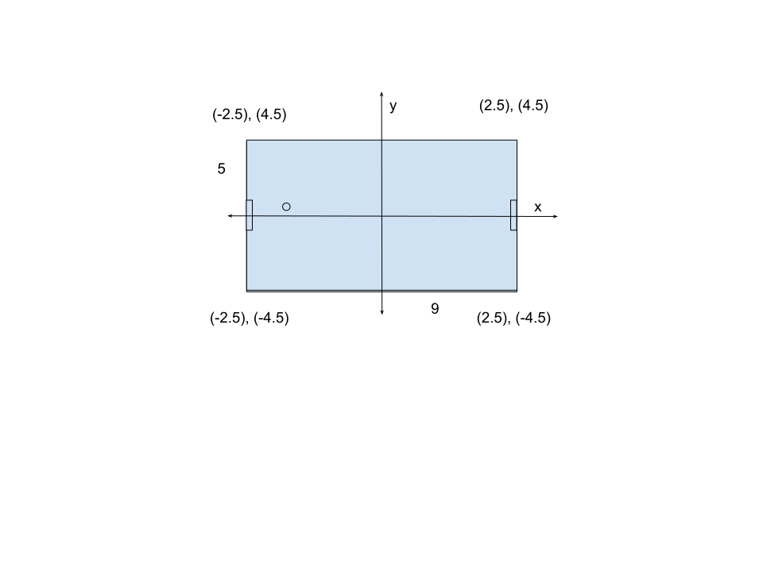

## Real table size
offical pong table is 9 (feet) long, 5 (feet) wide. 

## Game coordinates (x), (y)
x = 0, y = 0 will be center of pong table.
* Left Up corner => (-2.5), (4.5)
* Left Down corner => (-2.5), (-4.5)
* Right Up corner => (2.5), (4.5)
* Right Down corner => (2.5), (-4.5)

## Sizes (x width, y height)
* Paddle size => (x: 0.2, y: 1.0)
* Ball size => (0.25) diameter of circle

# Svg
 